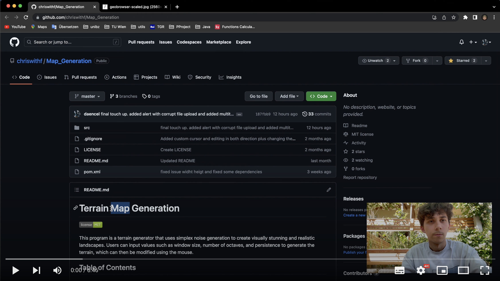
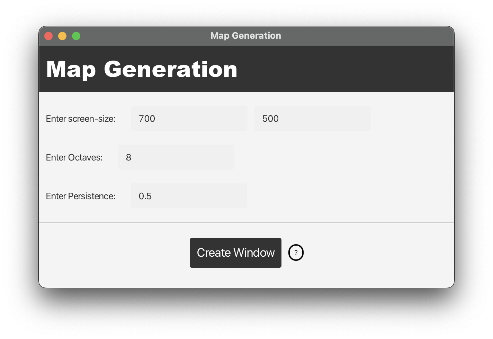
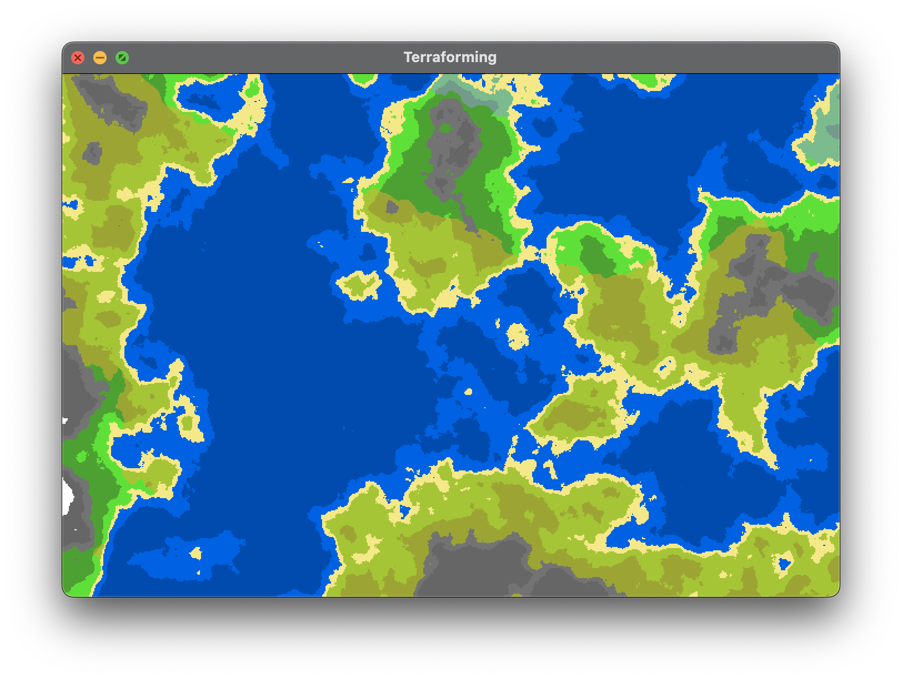
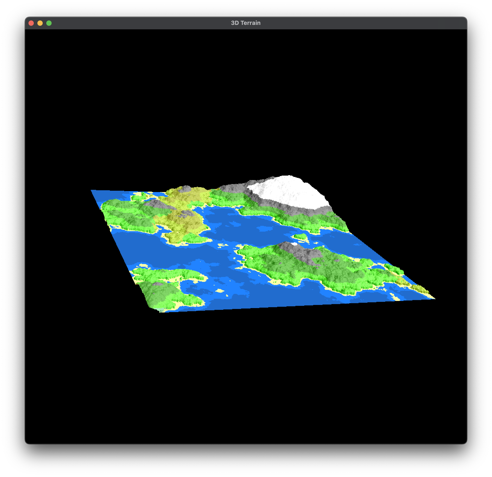
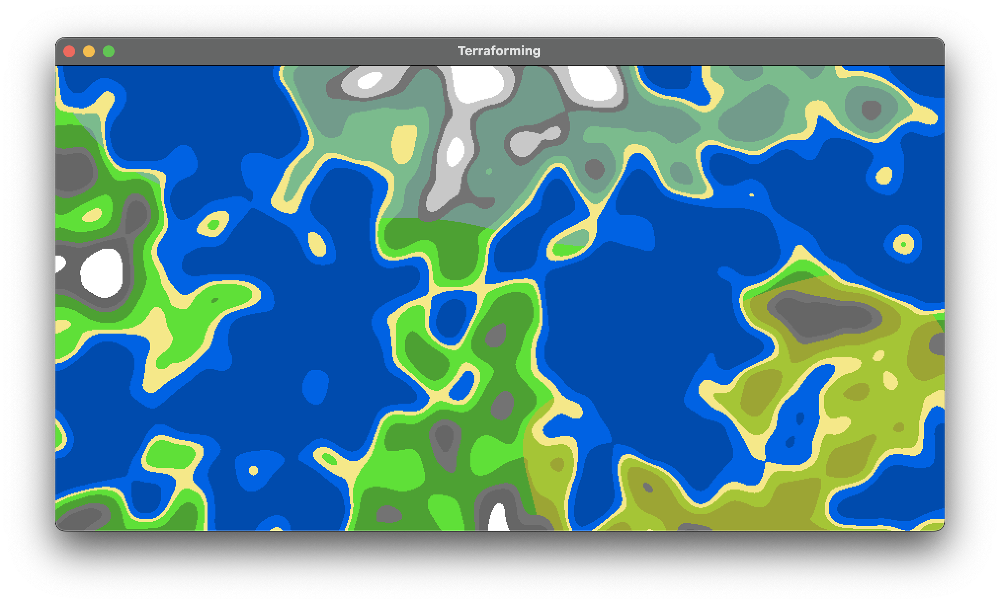
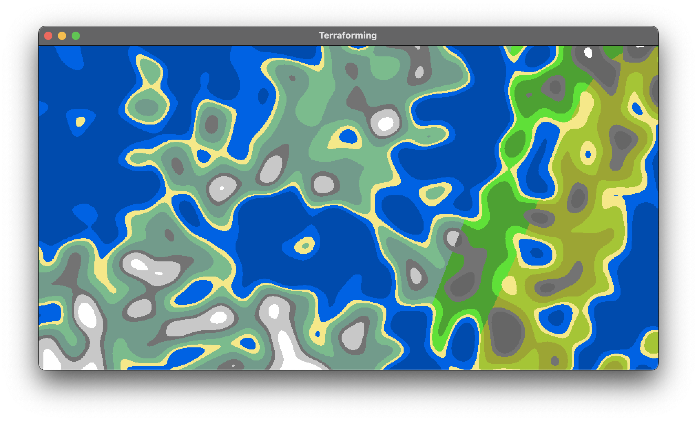
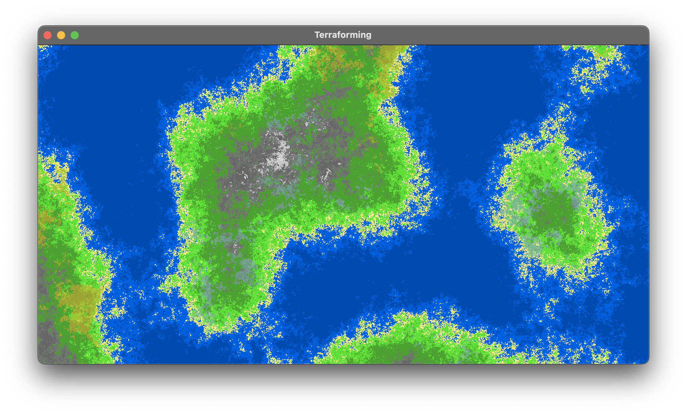
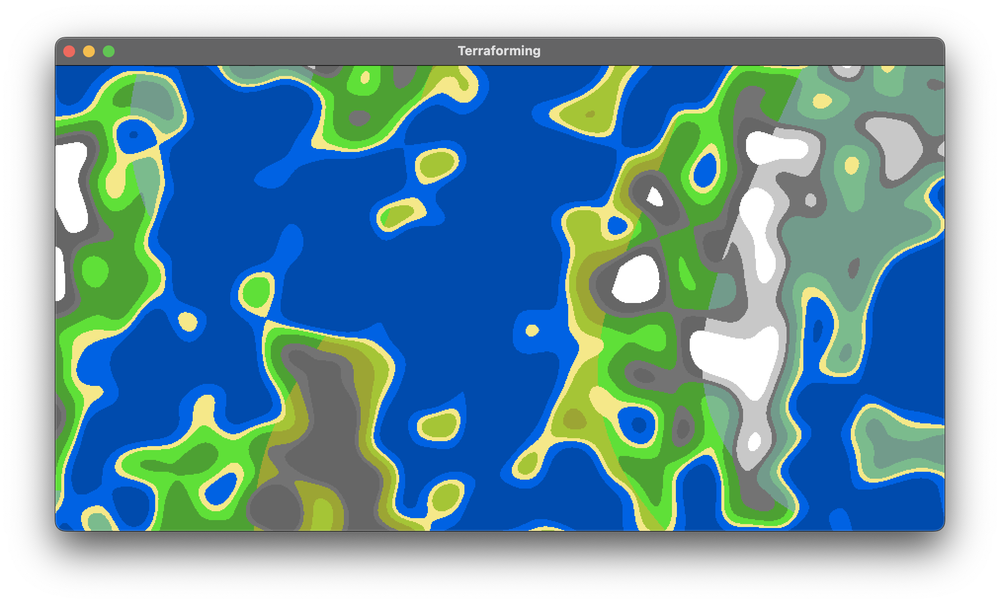

# Terrain Map Generation


This program is a terrain generator that uses simplex noise generation to create visually stunning and realistic
landscapes. Users can input values such as window size, number of octaves, and persistence to generate the terrain,
which can then be modified using the mouse.

## Table of Contents

- [Installation](#installation)
- [Video Tutorial](#video-tutorial)
- [Usage](#usage)
  - [Setup](#setup)
  - [Setup Inputs](#inputs-for-setup)
  - [Terraforming](#terraforming)
  - [Terraforming Inputs](#inputs-for-terraforming)
  - [Visualization](#visualization)
  - [Visualization Inputs](#inputs-for-visualization)
- [Comparison](#comparison-of-different-inputs)
- [Contribuitons](#contributions)
- [License](#license)


## Installation

To build it, you will need to download and unpack the latest (or recent) version of
[Maven](https://maven.apache.org/download.cgi)
and put the mvn command on your path.
Then, you will need to install
a [Java 17](https://www.oracle.com/java/technologies/javase/jdk17-archive-downloads.html) (or higher) JDK (not JRE!),
and make sure you can run `java` from the command
line.
Now you can run

```sh 
mvn clean install
```

Maven will compile your project,
and put the results it in a jar file in a `target` directory.

However, to run the application, make sure you are in the project folder and type

```sh 
mvn exec:java
```

## Video Tutorial

We encourage you to watch this 5 minutes tutorial where Daniel explains the installation and usage of the "Map Generation" program. To play the video, click on the image below.

[](https://www.youtube.com/watch?v=yXxyfTJ-Nwc "Video")

## Usages

### Setup

When the application is launched, a graphical user interface window will appear, providing users with the ability to
configure various parameters of the terrain generation process.
This includes setting up parameters such as window size, number of octaves, and persistence.



The term <b>octaves</b> refers to the number of times a noise algorithm is
iterated to produce the terrain. By increasing the number of octaves, the complexity and detail of the terrain generated
is enhanced. <br>
The <b>persistence</b> value, on the other hand, determines the degree of influence of each octave in the final terrain
generation. If the persistence value is higher, the transition between different terrain heights will be smoother and
more gradual, while a lower value will cause more sudden changes in elevation.
### Inputs for setup:
- Screen  size must be between <b>300 - screen size</b>
- Octaves must be between <b>1 - 10</b>
- Persistance must be between <b>0.1 - 1</b>

Once the user has input the
desired values, they can initiate the terraforming process by clicking `Create Window`.
Multiple instances of the terraforming process can be run from within the application.


### Terraforming



After the terrain generation process is completed, the user can perform modifications to the terrain using the trackpad
and/or mouse input.
The user can lower the terrain elevation by <b>right-clicking</b> on the terrain, whereas <b>left-clicking</b> raises
the elevation.
Additionally, the user can modify the cursor radius by pressing the <b>+ and -</b> keys. The cursor is used to define
the area of the terrain that will be modified by the trackpad or mouse clicks.
### Inputs for Terraforming:
- Increase mouse radius by pressing <b>'+'</b>
- Decrease mouse radius by pressing <b>'-'</b>
- Elevate terrain with a <b>left click</b> on a position
- Lower terrain with a <b>right click</b> on a position
- Export PNG by pressing <b>','</b>
- Export JSON by pressing <b>'#'</b>
- Import JSON by pressing <b>'.'</b>

### Visualization



### Inputs for Visualization:
- to rotate to the left press the <b>left arrow</b>
- to rotate to the right press the <b>right arrow</b>
- to rotate to the top press the <b>up arrow</b>
- to rotate to the bottom press the <b>down arrow</b>
- <b>Ctrl</b> and <b>mouse drag or scroll</b> to move in space

---

## Comparison of different inputs

- high Octaves, low persistence
  

- low Octaves, high persistence
  

- high Octaves, high persistence
  

- low Octaves, low persistence
  


## Contributions

[Hochrainer Christof](https://github.com/chriswithf)<br>
[Eddie Freitag](https://github.com/EddieFreitag)<br>
[Daniel F. Di Bella](https://github.com/daencel)


## License

> You can check out the full license [here](https://github.com/chriswithf/Map_Generation/blob/master/LICENSE)

This project is licensed under the terms of the **MIT** license.
